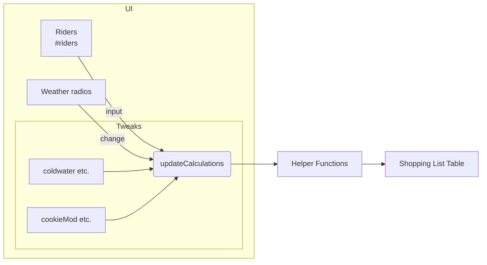

# Cycling Consumables Estimator

A single-page web tool that calculates the **quantities and estimated costs** of water, ice, sports drink, snacks, and other ride-support consumables for cycling events.

---

## Table of Contents

1. Quick Start
2. How It Works
3. Public JavaScript API
4. UI Components & Data Flow
5. Advanced Configuration
6. Example Scenarios
7. Extending / Integrating
8. Project Structure
9. License

---

## 1. Quick Start

1. Clone or download the repository.
2. Open `index.html` in any modern browser (Chrome, Firefox, Edge, Safari).
3. Fill in the **Event Configuration** fields (number of riders, stops, maximum mileage, weather).
4. Optionally fine-tune cost and modifier values in **Advanced Modifications**.
5. The **Shopping List** updates instantly with required quantities and cost estimates.

No build step or external dependencies are required; everything runs client-side.

---

## 2. How It Works

The estimator consists of:

* **HTML controls** that collect event parameters (riders, weather etc.) and cost/modifier overrides.
* A lightweight **JavaScript engine** (≈100 LOC) that recalculates totals whenever an input changes.
* **jQuery 1.8** is loaded from a CDN purely for concise event-handling.

The core logic lives in eight pure functions (see API section) that transform numeric inputs into consumable quantities.

---

## 3. Public JavaScript API

Although the tool is primarily UI-driven, all calculation helpers are pure functions attached to the global scope. They can be called directly from the browser console or imported into other projects.

### 3.1 `updateCalculations()`

```
updateCalculations() => void
```

Re-reads every `<input>` element, calls the calculator helpers below, and writes updated quantities **and** costs back to the DOM.

It is bound to:

* `document.ready` (initial render)
* `change` on every radio button
* `input` on every other input element

> Tip: Call this function after programmatically changing any input values to sync the UI.

---

### 3.2 Helper Functions

| Function | Signature | Purpose |
|----------|-----------|---------|
| `getWaterValue(weather)` | `(weather: "cold" \| "cool" \| "warm" \| "hot") => number` | Translates selected weather into **ounces of water per rider** using tweak panel values (`#coldwater`, `#coolwater`, etc.). |
| `getIceValue(weather)` | `(weather: same) => number` | Translates weather into **10-lb ice bags per 128 riders**. |
| `waterCalc(riders, waterMod, stops, mileageMod)` | `(number, number, number, number) => number` | Calculates total **gallons of water** required. |
| `iceCalc(waterGallons, iceMod, stops)` | `(number, number, number) => number` | Calculates **bags of ice** required. Returns `0` if `iceMod` is `0`. |
| `gatoradeCalc(waterGallons, stops)` | `(number, number) => number` | Estimates **2-gallon Gatorade packages** using a 0.5× ratio of water → drink concentrate. |
| `foodCalc(riders, itemMod, mileageMod, stops)` | `(number, number, number, number) => number` | General-purpose formula for cookies, trail mix, crackers, pretzels, oranges, bananas. Returns **rounded package counts**. |
| `cupCalc(trailMixPounds, cupMod)` | `(number, number) => number` | Calculates **100-cup packs** based on trail-mix ounces per cup.` |

All helpers **return rounded integers** suitable for purchasing.

#### 3.2.1 Formula Details

1. **Mileage Modifier**  \(\text{mileageMod} = \frac{\text{maxMiles}}{\text{avgMiles}}\)
2. **Water**  \(\text{gallons} = \Big\lfloor\frac{\lceil \frac{\text{riders} \times \text{waterMod} \times \text{mileageMod}}{128} + 0.5 \rceil}{\text{stops}} + 1\Big\rfloor \times \text{stops}\)
3. **Ice**  \(\text{bags} = 0\) if `iceMod == 0` else similar rounding logic.
4. **Gatorade** 0.5 × water gallons × 0.67 concentrate ratio.
5. **Food & Cups** use proportional scaling with rounding to the nearest stop interval.

---

## 4. UI Components & Data Flow



* **Input elements** store raw numbers.
* `updateCalculations()` gathers values → calls helpers.
* **Computed results** are injected into `<a>` elements in the Shopping List table.

---

## 5. Advanced Configuration

The **Advanced Modifications** panel lets you fine-tune:

* Per-weather **water ounces** and **ice bags**.
* Per-item **costs** and **consumption modifiers**.
* **Average mileage** to scale quantities for longer or shorter routes.

All fields are "live"—changes propagate immediately without refreshing.

---

## 6. Example Scenarios

### 6.1 Century Ride, Hot Weather

| Parameter | Value |
|-----------|-------|
| Riders | 200 |
| Stops | 6 |
| Max Miles | 100 |
| Weather | Hot |
| Average Miles | 30 |

Outcome (default modifiers):

* **Water:** 352 gal  (≈176 × 2-gal jugs)
* **Ice:** 22 × 10-lb bags
* **Gatorade:** 118 packages (2 gal each)
* **Cookies:** 40 boxes
* *(…additional line items omitted)*

### 6.2 Small Club Ride, Cool Morning

* 40 riders, 2 stops, 30 miles, weather = Cool ⇒ approximately 10 gal water, 1 bag ice, etc.

---

## 7. Extending / Integrating

Because each helper is a pure function, you can:

1. **Import** the calculator into another project by embedding `<script src="index.html">` or copying the JS block.
2. **Run headless** calculations:

   ```html
   <script>
   const gallons = waterCalc(75, 16, 3, 1.2);
   console.log(`Buy ${gallons} gallons of water`);
   </script>
   ```
3. **Replace jQuery** with vanilla JS by mapping the same event bindings.
4. **Internationalize** costs/units by updating labels and rounding logic.

---

## 8. Project Structure

```
├── index.html   # UI + embedded JS logic
└── README.md    # ← you are here!
```

*No build tools, transpilers, or package managers—just open the file.*

---

## 9. License

This project is released under the **MIT License**. See `LICENSE` for details.
